# Architecture Overview

This document provides a concise view of how the codebase is organized and how the core systems interact at runtime.

## High-level Runtime Mapping
- ServerScriptService/Server: all server-side services and orchestration
- StarterPlayerScripts/Client: client entry point and controllers
- ReplicatedStorage/Shared: shared constants and types
- ReplicatedStorage/Remotes: server-client messaging
- Workspace: live entities, spawn points, and safe room volumes

## Architecture Diagram (Mermaid)

```mermaid
flowchart TB
  subgraph Client[StarterPlayerScripts/Client]
    ClientEntry[Client.client.lua]
    UIController
    AmbientSoundController
    DamageFeedbackController
    HorrorLightingController
  end

  subgraph Remotes[ReplicatedStorage/Remotes]
    GameState
    EntityUpdate
    FireWeapon
    FireResult
    AmmoUpdate
    AttemptRescue
    RevivePlayer
    DamageEvent
    DealDamage
    PlayerAction
    UseItem
  end

  subgraph Server[ServerScriptService/Server]
    ServerEntry[Server.server.lua]
    GameService
    DirectorService
    EntityService
    PlayerService
    WeaponService
    SpawnPointService
    SafeRoomService
    EntityFactory
    BaseEnemy
    Specials[Specials: Hunter/Smoker/Boomer/Tank/Witch]
  end

  subgraph World[Workspace]
    Enemies
    SpawnPoints
    SafeRoomZone
  end

  ClientEntry --> UIController
  ClientEntry --> AmbientSoundController
  ClientEntry --> DamageFeedbackController
  ClientEntry --> HorrorLightingController

  ClientEntry -- input --> FireWeapon
  ClientEntry -- rescue --> AttemptRescue
  ClientEntry -- revive --> RevivePlayer

  GameState --> UIController
  GameState --> AmbientSoundController
  GameState --> HorrorLightingController
  DamageEvent --> DamageFeedbackController
  FireResult --> DamageFeedbackController
  FireResult --> ClientEntry
  AmmoUpdate --> ClientEntry

  ServerEntry --> GameService
  ServerEntry --> PlayerService
  ServerEntry --> SpawnPointService
  ServerEntry --> EntityService
  ServerEntry --> WeaponService
  ServerEntry --> SafeRoomService
  ServerEntry --> DirectorService

  DirectorService --> SpawnPointService
  DirectorService --> EntityService
  EntityService --> BaseEnemy
  EntityService --> Specials
  EntityService --> Enemies
  SpawnPointService --> SpawnPoints

  PlayerService --> GameService
  PlayerService --> DamageEvent
  WeaponService --> FireResult
  WeaponService --> AmmoUpdate
  GameService --> GameState
  DirectorService --> GameState
  SafeRoomService --> GameService
  SafeRoomService --> DirectorService
  SafeRoomService --> SafeRoomZone
```

## Server Service Responsibilities
- GameService: owns game state, player state, and broadcast of game state changes.
- PlayerService: health/incap/revive flow, damage application, damage feedback events.
- DirectorService: AI pacing, intensity, special infected spawns, director state broadcasts.
- SpawnPointService: collects spawn points and supplies spawn positions.
- EntityService: central NPC manager, update loop, spawns all infected variants.
- WeaponService: authoritative hit detection, ammo, and fire result feedback.
- SafeRoomService: safe room detection, heals/revives, and state transitions.
- EntityFactory: builds models for common and special infected.

## Client Controllers
- UIController: HUD, death screen, state notifications.
- AmbientSoundController: ambient audio and heartbeat on low health.
- DamageFeedbackController: vignette, hit markers, directional indicators.
- HorrorLightingController: fog, color correction, and intensity changes.

## Core Data Flows
- Weapon firing: Client -> FireWeapon -> WeaponService -> FireResult/AmmoUpdate -> Client.
- Damage feedback: PlayerService -> DamageEvent -> Client damage controller.
- Game state: GameService/DirectorService -> GameState -> UI and atmosphere controllers.
- Safe room: SafeRoomService monitors SafeRoomZone and drives GameService/DirectorService.

## Service Initialization Order
1. GameService
2. PlayerService
3. SpawnPointService
4. EntityService
5. WeaponService
6. SafeRoomService
7. DirectorService
